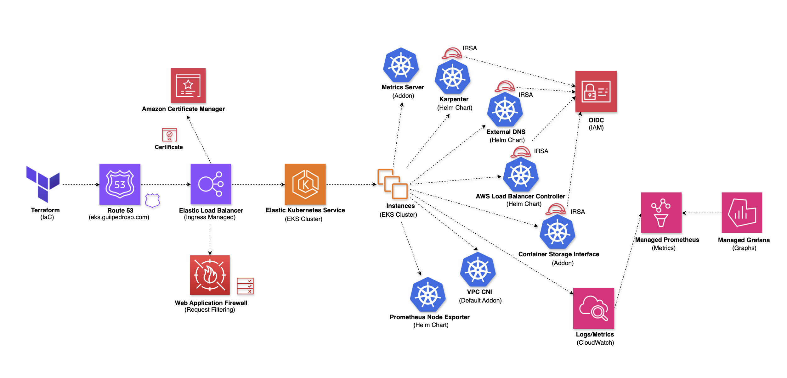
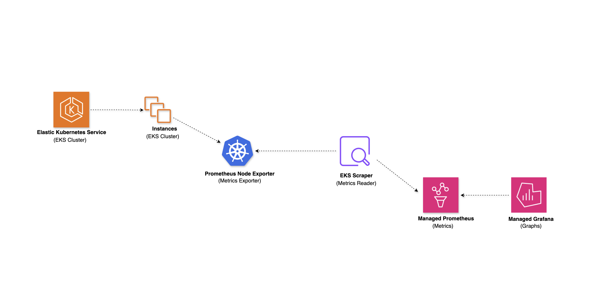
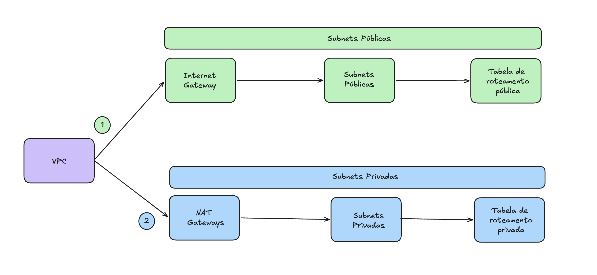

# ☸️ Scalable Data Platform on EKS with Karpenter & Terraform

<div align="center">


**Reference implementation of a production-grade EKS data platform provisioned with Terraform.**

Includes multi-AZ networking, IRSA, Karpenter autoscaling, WAF, ACM, External DNS, and managed observability. Validated end-to-end in AWS and designed as a reusable foundation for client environments.

*Built by a 2x AWS Certified, 3x Cisco Certified Cloud & DevOps Engineer.*

[Architecture](#-architecture) • [Stacks](#-infrastructure-stacks) • [Tech Stack](#-tech-stack) • [Deploy](#-deploy-order) • [Project Structure](#-project-structure)

</div>

## 📋 Overview

This project provisions a **complete production-grade Kubernetes platform on AWS** using Terraform, organized into independent stacks following Infrastructure as Code best practices. It deploys an Amazon EKS cluster with dynamic autoscaling via **Karpenter**, secured by **WAF**, exposed through an **ALB Ingress with HTTPS**, and fully observable via **Amazon Managed Prometheus and Grafana**.

The code is designed as a **reusable reference architecture**. Each stack is self-contained, independently deployable, and communicates via remote state, making it straightforward to adapt to different projects and client environments.

## 🎯 What It Solves

Running a scalable data platform on Kubernetes in production requires more than just a cluster. This infrastructure addresses the full stack:

**Dynamic autoscaling:** Karpenter provisions right-sized nodes on demand, without pre-defined node groups for workloads.

**Secure ingress:** WAFv2 with managed rule groups, geo-filtering, and custom 403 responses.

**Automated TLS:** ACM certificates with DNS validation, rotated automatically.

**Automated DNS:** External DNS syncs Kubernetes Ingress annotations to Route 53 records.

**Identity and permissions:** IRSA (IAM Roles for Service Accounts) for every component that touches AWS APIs.

**Full observability:** metrics scraped from EKS into Amazon Managed Prometheus, visualized in Grafana.

## 🏗 Architecture

### Platform Overview



End-to-end flow from Terraform provisioning through Route 53, WAF, ALB Ingress, EKS worker nodes, add-ons, Helm charts, IRSA/OIDC, and the observability stack (CloudWatch, Amazon Managed Prometheus, Grafana).

### Observability Pipeline



Metrics pipeline: Prometheus Node Exporter runs as a DaemonSet on each EKS worker node, the EKS Scraper (Amazon Managed Service for Prometheus) collects and stores those metrics, and the data is then visualized in Grafana.

Two Grafana strategies are maintained in this repository:

| Strategy | Deployment | Purpose |
|---|---|---|
| **Grafana OSS** (Helm, in-cluster) | `grafana.devopsengineeracademy.com` | Live demo — validated end-to-end in this environment |
| **Amazon Managed Grafana** (Terraform) | Managed AWS service | Production reference architecture — kept as IaC in `grafana.workspace.tf` |

The managed Grafana configuration is preserved as an architectural reference. For production deployments it is preferred over in-cluster Grafana: it remains available even if the EKS cluster goes down, and it integrates natively with IAM Identity Center (SSO).

### Networking


Multi-AZ VPC in `us-east-1` with public subnets for the ALB and NAT Gateways, private subnets for EKS worker nodes, and dedicated observability subnets for the Prometheus scraper and Grafana.



Logical routing model: public path via Internet Gateway, private path via NAT Gateways, with route tables and subnet associations.

### Traffic Flow

```
Internet
    │
    ▼
[ Route 53 ]  ←  External DNS (auto-managed records)
    │
    ▼
[ WAF Web ACL ]  ←  Geo-filtering + Managed Rules + Bot Control
    │
    ▼
[ Application Load Balancer ]      ← public subnets (us-east-1a, us-east-1b)
    │  (HTTPS 443 → Ingress)
    ▼
[ EKS Cluster 1.36 ]               ← private subnets
    │
    ├── [ Node Group (fixed) ]      ← 3x t3.medium, AL2023, rolling updates
    │
    └── [ Karpenter ]               ← dynamic nodes (m/t family, on-demand)
            │
            ├── Workload pods
            └── Observability pods
                    │
                    ▼
        [ Prometheus Node Exporter ]
                    │
                    ▼
        [ Amazon Managed Prometheus ]
                    │
                    ├── [ Amazon Managed Grafana ]  ← production reference (IaC preserved)
                    │
                    └── [ Grafana OSS / Helm ]      ← live demo (in-cluster, IRSA + SigV4 proxy)
```

### VPC Layout

```
VPC: 10.0.0.0/16  (65,536 IPs)
│
├── us-east-1a
│   ├── public-subnet      10.0.0.0/20   →  Internet Gateway
│   ├── private-subnet     10.0.32.0/20  →  NAT Gateway (1a)
│   └── observability      10.0.64.0/20  →  NAT Gateway (1a)
│
└── us-east-1b
    ├── public-subnet      10.0.16.0/20  →  Internet Gateway
    ├── private-subnet     10.0.48.0/20  →  NAT Gateway (1b)
    └── observability      10.0.80.0/20  →  NAT Gateway (1b)
```

## 📦 Infrastructure Stacks

The project is structured into **6 independent Terraform stacks**, each with its own S3 remote state and DynamoDB lock. They communicate via `terraform_remote_state`, not direct module calls.

| Stack | Description | State Key |
|---|---|---|
| `state-backend` | S3 bucket for remote state (uses S3 native locking via `use_lockfile`) | `backend/terraform.tfstate` |
| `networking` | VPC, subnets (public / private / observability), IGW, NAT Gateways, route tables | `networking/terraform.tfstate` |
| `cluster` | EKS 1.36, node group, OIDC provider, IRSA, ALB Controller, External DNS, ACM | `eks-cluster/terraform.tfstate` |
| `autoscaling` | Karpenter 1.13.0: IAM, Helm release, CRDs, NodePool, EC2NodeClass | `karpenter/terraform.tfstate` |
| `security` | WAFv2 Web ACL (Regional) with geo-filtering and managed rule groups | `security/terraform.tfstate` |
| `observability` | Amazon Managed Prometheus, Prometheus scraper, Grafana OSS (Helm), Node Exporter | `monitoring/terraform.tfstate` |

### Stack Dependencies

```
state-backend
     │
     ▼
networking
     │  (VPC/subnet discovery via AWS tags)
     ▼
cluster ──────────────────────────────┐
     │                                │
     │  (terraform_remote_state)      │  (terraform_remote_state)
     ▼                                ▼
autoscaling                      observability

security  (standalone, attached to ALB via Ingress annotation)
```

## 🔐 IRSA: IAM Roles for Service Accounts

Every component that calls AWS APIs uses **IRSA** (federated identity via OIDC), following the principle of least privilege.

| Service Account | IAM Role | Permissions |
|---|---|---|
| `aws-load-balancer-controller` | `guiipedroso-dev-alb-controller-role` | EC2, ELB, WAF, ACM, Route53 read/write |
| `external-dns` | `guiipedroso-dev-external-dns-role` | Route53 `ChangeResourceRecordSets`, `ListHostedZones` |
| `ebs-csi-controller-sa` | `guiipedroso-dev-ebs-csi-driver-role` | `AmazonEBSCSIDriverPolicy` |
| `karpenter` | `guiipedroso-dev-KarpenterControllerRole` | EC2 fleet, launch templates, instance profiles |
| `grafana` | `guiipedroso-dev-GrafanaHelmRole` | `AmazonPrometheusQueryAccess` (query AMP via SigV4 proxy) |

## 🛡 WAF Rules

The WAFv2 Web ACL applies 8 rules in priority order:

| Priority | Rule | Action |
|---|---|---|
| 1 | Geo-match: non-BR requests | Label `guiipedroso:suspicious:request` |
| 2 | AWS Managed: IP Reputation List | Count |
| 3 | AWS Managed: Anonymous IP List | Count |
| 4 | AWS Managed: SQLi Rule Set | Count |
| 5 | AWS Managed: Bot Control | Count |
| 6 | AWS Managed: Common Rule Set | Count |
| 98 | Label match: any `awswaf:managed:aws:*` | Label `guiipedroso:suspicious:request` |
| 99 | Label match: `guiipedroso:suspicious:request` | **Block** with custom 403 JSON response |

## 🛠 Tech Stack

| Category | Technology | Version |
|---|---|---|
| **IaC** | Terraform | >= 1.15.0 |
| **Cloud Provider** | AWS Provider (HashiCorp) | ~> 6.0 |
| **Helm Provider** | Helm Provider (HashiCorp) | ~> 2.17 |
| **Container Orchestration** | Amazon EKS | 1.36 |
| **Node OS** | Amazon Linux 2023 (AL2023) | kernel 6.12 |
| **Autoscaling** | Karpenter | 1.13.0 |
| **Ingress** | AWS Load Balancer Controller | 3.4.0 |
| **DNS Automation** | External DNS | 1.21.1 |
| **TLS** | AWS Certificate Manager (ACM) | Managed |
| **Security** | AWS WAFv2 | Managed |
| **Networking** | VPC, NAT Gateway, multi-AZ | Managed |
| **Metrics** | Amazon Managed Prometheus (AMP) | Managed |
| **Dashboards** | Amazon Managed Grafana (managed, prod reference) | Managed |
| **Dashboards (dev)** | Grafana OSS via Helm | 10.5.15 |
| **Node Metrics** | Prometheus Node Exporter | Latest |
| **Storage** | AWS EBS CSI Driver | Managed |
| **State Backend** | S3 + native lockfile (`use_lockfile`) | Managed |

## 📁 Project Structure

```
eks_project/
├── .terraform-version                   # Pins Terraform CLI to 1.15.6 (tfenv)
├── docs/
│   ├── arch.png                         # Full architecture diagram
│   ├── aws_cloud.png                    # VPC/networking topology
│   └── vpc_config.png                   # VPC logical model
│
├── state-backend/                       # Stack 1: S3 remote state (native lockfile)
│   ├── main.tf
│   ├── variables.tf
│   └── s3.bucket.tf
│
├── networking/                          # Stack 2: VPC, subnets, NAT, route tables
│   ├── main.tf
│   ├── variables.tf
│   ├── outputs.tf
│   ├── vpc.tf
│   ├── vpc.internet-gateway.tf
│   ├── ec2.eips.tf
│   ├── vpc.nat-gateways.tf
│   ├── vpc.public-subnets.tf
│   ├── vpc.public-route-table.tf
│   ├── vpc.private-subnets.tf
│   ├── vpc.private-route-tables.tf
│   ├── vpc.observability-subnets.tf
│   └── vpc.observability-route-table-association.tf
│
├── cluster/                             # Stack 3: EKS, IRSA, addons, Helm, ACM
│   ├── main.tf
│   ├── variables.tf
│   ├── outputs.tf
│   ├── locals.tf
│   ├── data.account.tf
│   ├── data.vpc.tf
│   ├── data.private-subnets.tf
│   ├── data.observability-subnets.tf
│   ├── data.hosted-zone.tf
│   ├── eks.cluster.tf
│   ├── eks.cluster.iam.tf
│   ├── eks.cluster.oidc.tf
│   ├── eks.cluster.node-group.tf
│   ├── eks.cluster.node-group.iam.tf
│   ├── eks.cluster.access.tf
│   ├── eks.cluster.addons.metrics-server.tf
│   ├── eks.cluster.addons.csi.tf
│   ├── eks.cluster.external.alb.tf
│   ├── eks.cluster.external.alb.iam.tf
│   ├── eks.cluster.external.dns.tf
│   ├── eks.cluster.external.dns.iam.tf
│   └── certificate-manager.cert.tf
│
├── autoscaling/                         # Stack 4: Karpenter
│   ├── main.tf
│   ├── variables.tf
│   ├── locals.tf
│   ├── data.account.tf
│   ├── data.cluster.remote-state.tf
│   ├── data.public-ecr.auth.tf
│   ├── karpenter.iam.tf
│   ├── karpenter.crds.tf
│   ├── karpenter.release.tf
│   ├── karpenter.resources.tf
│   ├── karpenter.security-group.tf
│   ├── helm/values.yml
│   ├── cli/karpenter-crds-create.sh
│   ├── cli/karpenter-resources-create.sh
│   └── resources/
│       ├── karpenter-node-pool.yml
│       └── karpenter-node-class.yml
│
├── security/                            # Stack 5: WAFv2 Web ACL
│   ├── main.tf
│   ├── variables.tf
│   └── waf.alb.acl.tf
│
└── observability/                       # Stack 6: AMP, Grafana, Node Exporter
    ├── main.tf
    ├── variables.tf
    ├── locals.tf
    ├── data.cluster.remote-state.tf
    ├── data.private-subnets.tf
    ├── prometheus.workspace.tf
    ├── prometheus.scraper.tf
    ├── grafana.workspace.tf              # Amazon Managed Grafana (production reference)
    ├── grafana.workspace.iam.tf
    ├── grafana.helm.tf                   # Grafana OSS via Helm (live demo, ACM + Ingress)
    ├── grafana.helm.iam.tf               # IRSA role for Grafana OSS → AMP
    ├── grafana/values.yml                # Helm values: datasource, SigV4 proxy sidecar, ingress
    ├── eks.cluster.addons.node-exporter.tf
    └── prometheus/scrape-config.yml
```

## 🚀 Deploy Order

Each stack must be applied in sequence. Destroy in the **reverse order**.

### Prerequisites

Before you start, make sure you have the following installed and configured:

**Terraform** >= 1.15.0

```bash
# Install tfenv (recommended)
brew install tfenv
tfenv install 1.15.6
tfenv use 1.15.6
terraform --version
```

**AWS CLI** v2 configured with credentials

```bash
aws configure
# or export AWS_PROFILE=your-profile
```

**kubectl** and **Helm** installed locally

```bash
brew install kubectl helm
```

**Permissions required:** EKS, VPC, IAM, Route 53, ACM, WAF, AMP, Amazon Managed Grafana

**Route 53 hosted zone** for your domain (this project uses `devopsengineeracademy.com`)

### Step 1 — Bootstrap: State Backend

> The `state-backend` stack uses **local state** intentionally. It creates the S3 bucket and DynamoDB table used by all other stacks. This solves the classic "chicken-and-egg" problem of storing bootstrap state in a bucket that doesn't exist yet.

```bash
cd state-backend
terraform init
terraform apply
```

Expected output:
```
aws_s3_bucket.this: Creating...
aws_s3_bucket_versioning.this: Creating...
aws_s3_bucket_server_side_encryption_configuration.this: Creating...
aws_s3_bucket_public_access_block.this: Creating...
Apply complete! Resources: 4 added.
```

### Step 2 — Networking

```bash
cd networking
terraform init \
  -backend-config="bucket=guiipedroso-dev-terraform-state" \
  -backend-config="use_lockfile=true" \
  -backend-config="region=us-east-1"
terraform apply
```

This provisions the VPC (`10.0.0.0/16`), public/private/observability subnets across two AZs, NAT Gateways, Internet Gateway, and all route tables with proper subnet tags for EKS and Karpenter discovery.

### Step 3 — Cluster

```bash
cd cluster
terraform init \
  -backend-config="bucket=guiipedroso-dev-terraform-state" \
  -backend-config="use_lockfile=true" \
  -backend-config="region=us-east-1"
terraform apply
```

> ⏱ This is the longest step (~10–15 min). The EKS control plane and ACM certificate DNS validation run in parallel.

After apply, configure `kubectl`:

```bash
aws eks update-kubeconfig \
  --region us-east-1 \
  --name guiipedroso-dev-eks-cluster
kubectl get nodes
```

### Step 4 — Autoscaling (Karpenter)

```bash
cd autoscaling
terraform init \
  -backend-config="bucket=guiipedroso-dev-terraform-state" \
  -backend-config="use_lockfile=true" \
  -backend-config="region=us-east-1"
terraform apply
```

After apply, install the Karpenter CRDs and resources via the provided scripts:

```bash
# Install CRDs (required before Karpenter can register NodePools)
bash cli/karpenter-crds-create.sh

# Apply NodePool and EC2NodeClass
export CLUSTER_NAME=guiipedroso-dev-eks-cluster
export KARPENTER_NODE_ROLE=guiipedroso-dev-KarpenterControllerRole
bash cli/karpenter-resources-create.sh
```

### Step 5 — Security (WAF)

```bash
cd security
terraform init \
  -backend-config="bucket=guiipedroso-dev-terraform-state" \
  -backend-config="use_lockfile=true" \
  -backend-config="region=us-east-1"
terraform apply
```

> The WAF ARN is output after apply. Reference it as an annotation (`alb.ingress.kubernetes.io/wafv2-acl-arn`) on your Kubernetes Ingress resource.

### Step 6 — Observability

```bash
cd observability
terraform init \
  -backend-config="bucket=guiipedroso-dev-terraform-state" \
  -backend-config="use_lockfile=true" \
  -backend-config="region=us-east-1"
terraform apply
```

### Destroy (reverse order)

```bash
cd observability  && terraform destroy
cd security       && terraform destroy
cd autoscaling    && terraform destroy
cd cluster        && terraform destroy
cd networking     && terraform destroy
# state-backend last — remove lifecycle prevent_destroy first if needed
cd state-backend  && terraform destroy
```

## 🔍 Key Implementation Highlights

### 1. Multi-Stack Remote State

Stacks communicate via `terraform_remote_state`, not direct module calls. This keeps each stack independently deployable:

```hcl
data "terraform_remote_state" "eks_cluster" {
  backend = "s3"
  config = {
    bucket = "guiipedroso-dev-terraform-state"
    key    = "eks-cluster/terraform.tfstate"
    region = "us-east-1"
  }
}

locals {
  eks_cluster_name     = data.terraform_remote_state.eks_cluster.outputs.eks_cluster_name
  eks_cluster_endpoint = data.terraform_remote_state.eks_cluster.outputs.eks_cluster_endpoint
  eks_oidc_arn         = data.terraform_remote_state.eks_cluster.outputs.kubernetes_oidc_provider_arn
}
```

### 2. IRSA Pattern

Every AWS-integrated workload uses federated identity via the cluster's OIDC provider:

```hcl
resource "aws_iam_role" "external_dns" {
  assume_role_policy = jsonencode({
    Statement = [{
      Effect = "Allow"
      Action = "sts:AssumeRoleWithWebIdentity"
      Principal = { Federated = aws_iam_openid_connect_provider.kubernetes.arn }
      Condition = {
        StringEquals = {
          "${local.eks_oidc_url}:sub" = "system:serviceaccount:external-dns:external-dns"
        }
      }
    }]
  })
}
```

### 3. Karpenter NodePool: Cost-Aware Autoscaling

Karpenter consolidates underutilized nodes aggressively and expires nodes every 8h to force periodic AMI refresh:

```yaml
spec:
  disruption:
    consolidationPolicy: WhenEmptyOrUnderutilized
    consolidateAfter: 1m
  template:
    spec:
      expireAfter: 8h
      requirements:
        - key: karpenter.sh/capacity-type
          values: ["on-demand"]
        - key: karpenter.k8s.aws/instance-category
          values: ["m", "t"]
```

### 4. Subnet Discovery via Tags

Networking and cluster stacks stay decoupled. The cluster stack discovers subnets by tags, not by ID:

```hcl
data "aws_subnets" "private" {
  filter {
    name   = "tag:Purpose"
    values = [var.eks_cluster.name]
  }
}
```

Private subnets are tagged at provisioning time:

```hcl
tags = {
  "karpenter.sh/discovery"          = var.vpc.eks_cluster_name
  "kubernetes.io/role/internal-elb" = "1"
  Purpose                           = var.vpc.eks_cluster_name
}
```

## 🔮 Roadmap

* [x] Grafana OSS no cluster via Helm com IRSA → Amazon Managed Prometheus (`grafana.devopsengineeracademy.com`)
* [ ] Apache Airflow on EKS (`airflow.devopsengineeracademy.com`)
* [ ] Wildcard ACM certificate (`*.devopsengineeracademy.com`)
* [ ] Spot instance support in Karpenter NodePool
* [ ] CI/CD pipeline for stack deployment (GitHub Actions)
* [ ] Horizontal Pod Autoscaler (HPA) examples
* [ ] `terraform.tfvars.example` with documented variables

## 👨‍💻 About Me

**DevOps / Cloud Engineer | AWS & Cisco Certified**

I design and provision production-grade cloud infrastructure using Infrastructure as Code. This project is a reference implementation of a scalable Kubernetes platform on AWS, built to be adapted and reused across different client environments.

### 🏆 Certifications


2x AWS Certified · 3x Cisco Certified

### 🔗 Connect with Me

[](https://www.linkedin.com/in/gui-pedroso/)
[](https://github.com/guiipedroso)
[](https://www.devopsengineeracademy.com)
[](mailto:pedroso.gui7@gmail.com)

<div align="center">

**If you found this project helpful, please consider giving it a ⭐!**

**Built with ❤️ by Guilherme Pedroso**

</div>
